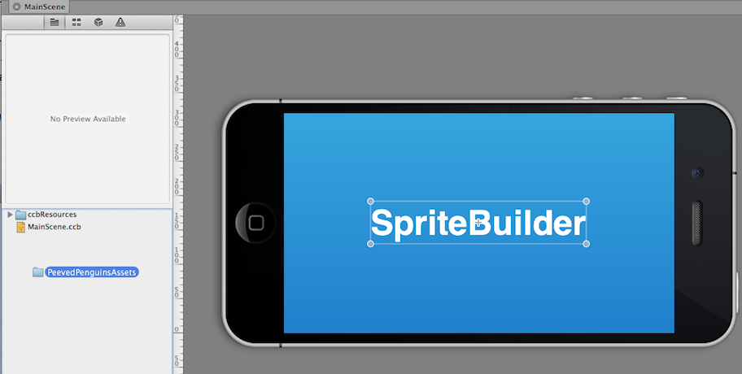
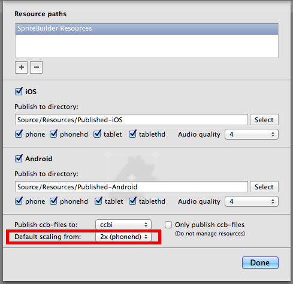
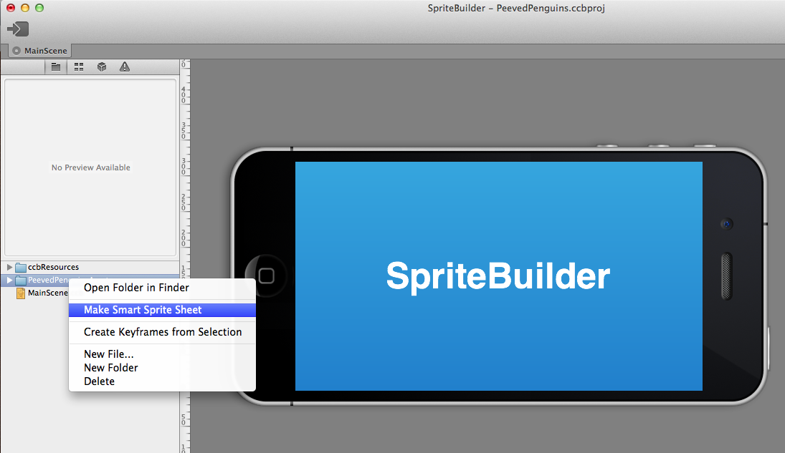
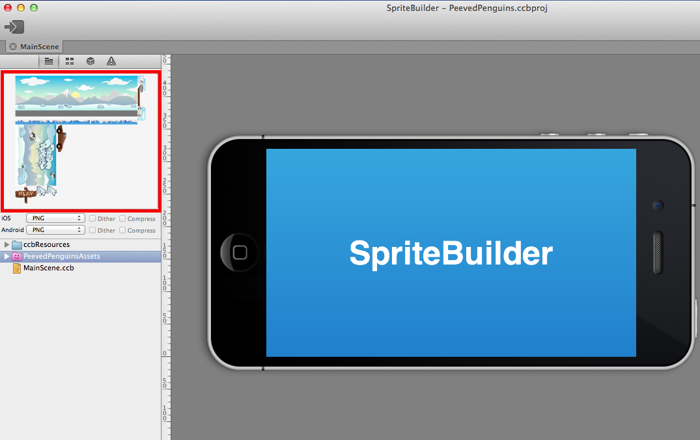

If you haven't already, create a new project in SpriteBuilder. Don't forget you can access the code for the completed game on [GitHub](https://github.com/MakeSchool/PeevedPenguins-Spritebuilder)!

Get started by downloading the Peeved Penguins art pack we created for you. Once the download is complete, unpack the folder.

##Importing resources
Drag the PeevedPenguinsAssets folder into the Resources pane (the empty space under MainScene.ccb). This will copy the assets to the correct location:

##Adjust the autoscaling settings
If you look at the resources folder you will notice that each image is only provided in one resolution instead of providing separate assets for retina and non-retina devices. This is possible because Spritebuilder supports _autoscaling_.

Thanks to SpriteBuilder's autoscaling you only need to provide the image with the highest resolution and the lower resolution images are generated automatically. If you've worked with Cocos2D before this means no more regular and -hd files!

SpriteBuilder is set up by default to downsize assets from a 4x resolution (double resolution of retina images). The Peeved Penguins assets are provided as 2x assets (retina resolution) so we have to change this setting for our project. Open File > Project Settings and change Default scaling to 2x (phonehd):

Now, when you publish through SpriteBuilder, it will auto-generate non-retina iPhone assets.

##Enabling Smart Sprite Sheet
SpriteBuilder has another nice feature you should use in your games: _Smart Sprite Sheets_. When you use smart sprite sheets, SpriteBuilder will automatically generate one large image out of all of your assets. This allows the device to load all your assets into memory at once and will speed things up when your game is running.

To transform your Peeved Penguin Assets into a spritesheet, you need to right-click onto the folder and select _Make Smart Sprite Sheet_:

After this your folder's icon should become pink. Now hit the publish button. That will generate your smart sprite sheet. If everything worked out you will see a nice preview of your sprite sheet when you select it in the resource pane:

Now you know how to add resources to your game and use some of the neat optimizations that come with SpriteBuilder.

Let's move on and learn how to create animations with SpriteBuilder!