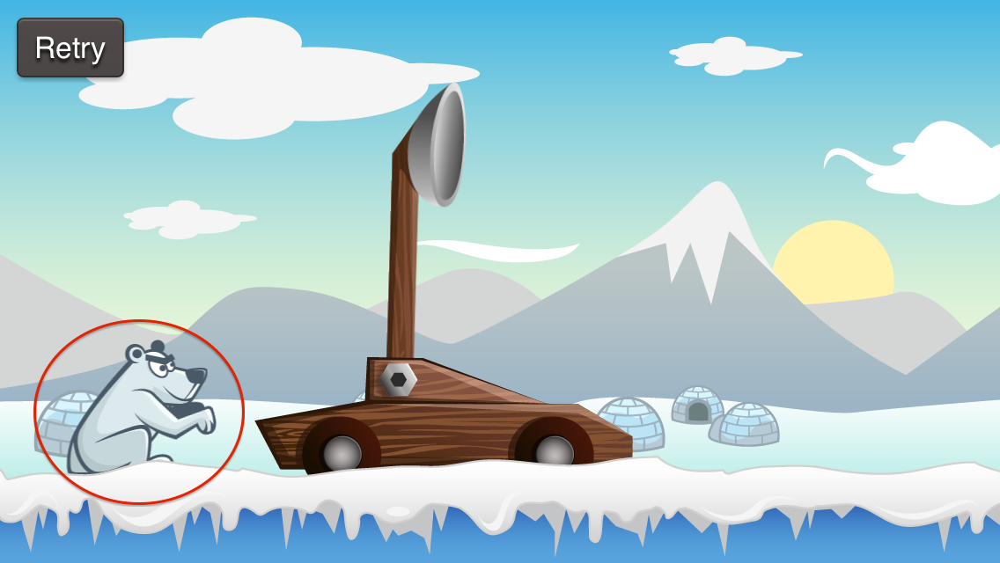
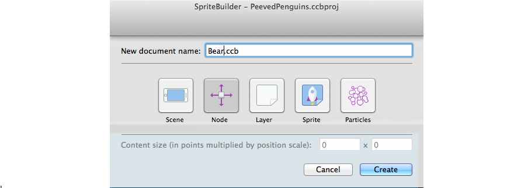
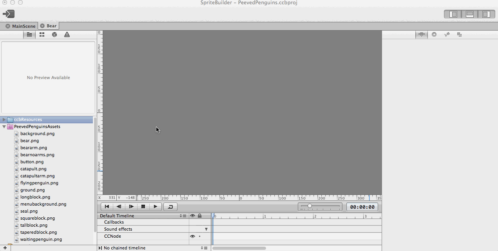
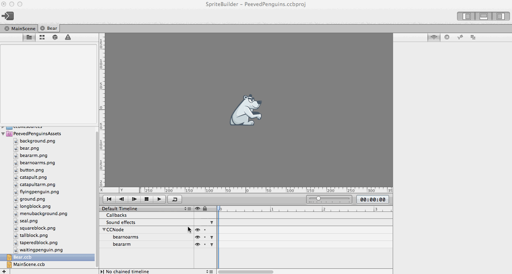
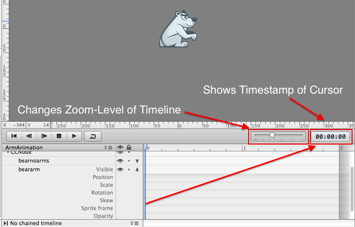
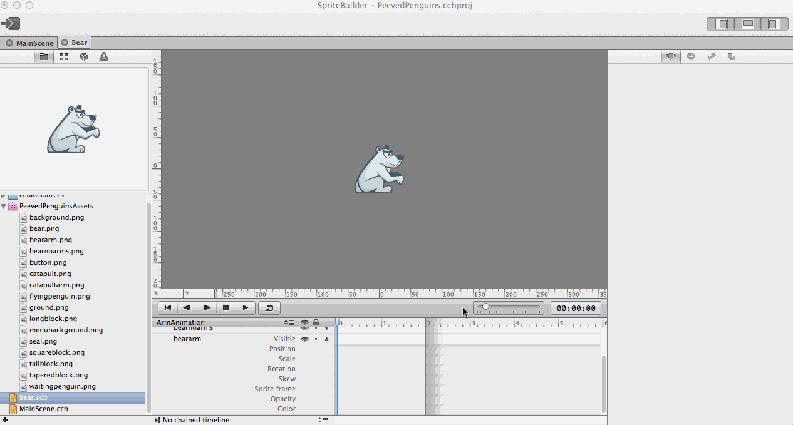
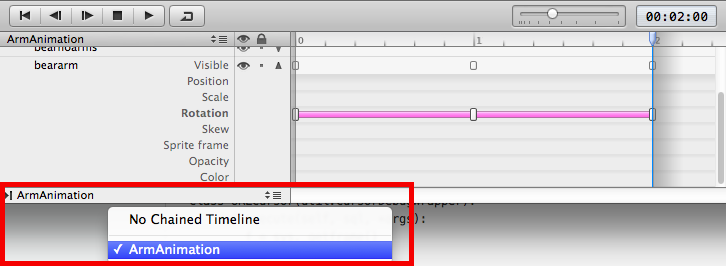

Let’s learn how to create animations with SpriteBuilder's timeline. For our game we want to add a taunting animation to a bear that will sit behind our catapult:

##Setting up a new .cbb file
The bear will have it's own .ccb file. Create a new Interface file called "Bear.ccb" (Top Bar: File>New>File) in your SpriteBuilder project, and select Node as root container:

We need to combine two images to make the bear: the body without an arm, and a separate arm that will be animated.

Add _bearnoarms.png_ and _beararm.png_ to the root node:

Place _bearnoarms.png_ at position (0.0, 0.0) in the preferences pane. Set the anchor point of _beararm.png_ to (0.0, 1.0) and it’s position to (-5.0, 10.0). We need to set the anchor point of the arm because we are going to rotate it. When we apply a rotation to a CCNode it rotates around its anchor point - for the arm, this should be somewhere near the shoulder, which is the top left corner of our image.

##Interlude: Keyframe based animations
Before you can create the actual animation you need a basic understanding of keyframe based animations. When you create animations with keyframes, you define how a value changes over a certain time. You define these value changes by defining the final value and a timestamp. For example, for the rotation of our arm we could define three time-value pairs:

<table>
  <thead>
    <th>Seconds</th>
    <th>Rotation in Degrees</th>
  </thead>
  <tbody>
    <tr>
      <td>0</td>
      <td>0</td>
    </tr>
    <tr>
      <td>1</td>
      <td>90</td>
    </tr>
    <tr>
      <td><2/td>
      <td>0</td>
    </tr>
  </tbody>
</table>

The special thing about keyframe based animations is that the values between the defined timestamps are tweened. This means that every value between the ones you have defined is calculated by some mathematical function. Assuming linear tweening, which we use most of the time, this means that, according to the table above, the rotation value at 0.5 seconds would be...? _Correct_: 45 degrees.

Once you understand this basic concept the creation of most animations will be rather intuitive to you.

##Setting the animation up
Now we can animate the polar bear’s arm. In Spritebuilder each animation is defined on its own timeline. If you have multiple animations for one object, you can add multiple timelines to the .cbb file. For our bear we are starting with only one animation. It is good practice to name the timeline like the animation happening on it, so we will rename our timeline to "ArmAnimation". We also need to set the duration of our animation - let's set it to two seconds:

Now it's time to add the three key frames we have described earlier. Keyframes are created in the timeline at the bottom of the screen. Using the control on the top right of the pane, you can zoom in and out:

Zoom in by dragging the slider on the left of the timecode a bit to the right. Select the arm of the bear and create three keyframes for _rotation_ at 0, 1 and 2 seconds. Do this by pressing _r_ (on your keyboard) when the time marker is set at the mentioned times. Update the rotation value at each to -15, 20, -15 respectively:

Click the play button in the timeline pane to see how it looks.

Last, we need to chain this animation to itself so that it will repeat when playing in our game:

Congratulations! You have just created your first keyframe based animation with SpriteBuilder. Next you will create Seals and Penguins for your game and learn how to build connections between SpriteBuilder objects and your code!
