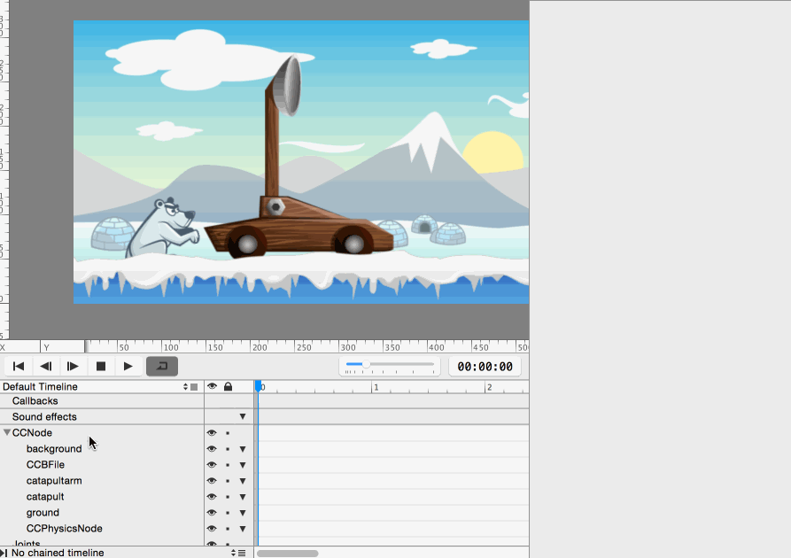

Time to grab your favorite hot beverage - we're diving right into the implementation of the core gameplay!

#Make it pretty

Let's start by adding some art to our new *Gameplay*.ccb file.

> [action]
> Drag *background.png* onto the stage. Set position and anchor point to (0,0); this will ensure the background is nicely aligned with the scene borders.

Next, let's add the bear we created previously. SpriteBuilder lets you include .ccb files in other .ccb files. This is a *super* powerful feature, and we will make extensive use of it.

> [action]
> Drag a *Sub File* Node from the *Node Library* to the stage. Select *bear.ccb* as *CCB File*:
>
> 

Now the bear sprite, including the animation we defined earlier, is part of the Gameplay scene!

> [action]
> Add *ground.png* to the stage. Set its position and anchor point to (0,0).

Finally, let's build the catapult.

> [action]
> Drag *catapult.png* and *catapultarm.png* to the stage.

<!-- Make School -->

> [info]
> The draw order is top to bottom so if you can't see one of your assets it is probably under something. Note that you can change the z-order of the objects in your scene by changing the order in the timeline at the bottom of the screen.

<!-- Make School -->

> [action]
> Now publish your SpriteBuilder project and run it in the Simulator. After the hitting the play button you should see something similar to this:
>
> 

#Shoot some penguins

We are first going to implement a simple shooting mechanism. In Cocos2D, physics objects can only be children of physics nodes. Since the penguins we are shooting will engage in the physics simulation, we are now going to add a physics node to our scene.

##In SpriteBuilder

> [action]
> Drag a *PhysicsNode* from the *Node Library* to the scene and position it at (0,0).

We are going to implement the penguin shooting in code so we need to set up some code connections.

> [action]
> First, set the custom class of the Gameplay root node, CCNode, to "Gameplay". Then set up a member variable link for the CCPhysicsNode. We want to assign it to Doc root var with the variable name "_physicsNode". This will link this physics node to a variable called "_physicsNode" of the class "Gameplay":
>
> 

Now we will be able to access the physics node from code. That will allow us to add the fired penguins to the scene.

> [action]
> Now create another code connection - all on your own. We want the *catapultarm* to be accessible through a variable called *_catapultArm* in the Gameplay class.

<!-- Make School -->

> [solution]
> Look at the steps above for creating a *Doc root var* code connection on *gamePhysicsNode*.

##In Xcode

Now we will need to switch to Xcode to implement a firing method.

> [action]
> First, create a new class *Gameplay*. That class needs to be a subclass of *CCNode*. When saving the class, make sure it is in the *Source* folder of your project.
>
> Add the member variables *_physicsNode* and *_catapultArm* to *Gameplay.m* (make sure to include the curly braces):
>
>        @implementation Gameplay {
>            CCPhysicsNode *_physicsNode;
>            CCNode *_catapultArm;
>        }

The simple shooting mechanism will be triggered whenever a player touches the screen. We are going to implement this touch handling in code.

> [action]
> Add these three methods to *Gameplay.m* to activate touch handling, process touches and launch penguins:
>
>        // is called when CCB file has completed loading
>        - (void)didLoadFromCCB {
>            // tell this scene to accept touches
>            self.userInteractionEnabled = TRUE;
>        }
>        
>        // called on every touch in this scene
>        - (void)touchBegan:(UITouch *)touch withEvent:(UIEvent *)event {
>            [self launchPenguin];
>        }
>        
>        - (void)launchPenguin {
>            // loads the Penguin.ccb we have set up in Spritebuilder
>            CCNode* penguin = [CCBReader load:@"Penguin"];
>            // position the penguin at the bowl of the catapult
>            penguin.position = ccpAdd(_catapultArm.position, ccp(16, 50));
>        
>            // add the penguin to the physicsNode of this scene (because it has physics enabled)
>            [_physicsNode addChild:penguin];
>        
>            // manually create & apply a force to launch the penguin
>            CGPoint launchDirection = ccp(1, 0);
>            CGPoint force = ccpMult(launchDirection, 8000);
>            [penguin.physicsBody applyForce:force];
>        }

The explanation for this code is within the comments. However, it is surprisingly simple.

> [action]
> When you run your app now and touch the screen, you should see penguins flying across the landscape:
>
> 
